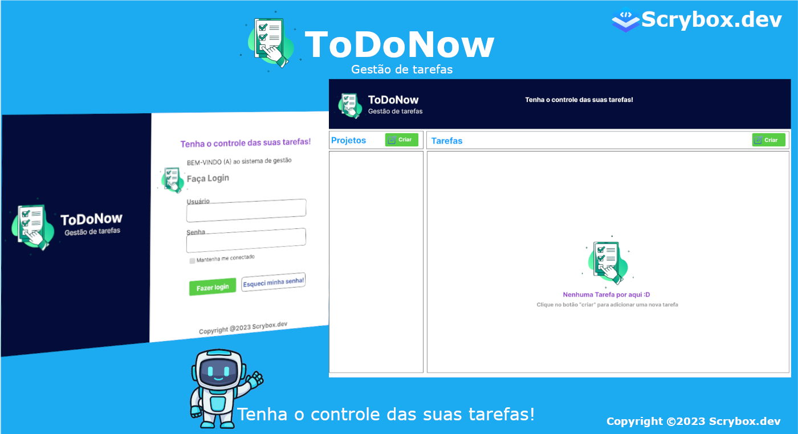
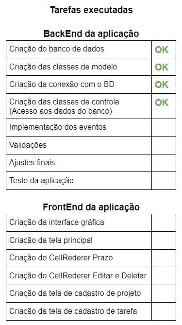

<h1>ToDoNow Gestão de tarefas</h1>

<h3>Tenha o controle das suas tarefas.</h3>

 

Definição do projeto desenvolvido no curso de Lógica de programação.

<h3>Descrição:</h3>
	
Aplicação para o gerenciamento de projetos e tarefas.

<h3>Objetivo:</h3>

Resolver a questão de organização de tarefas de um ou vários projetos.

<h3>Entidades:</h3>
<ul><li><h3>Projeto</h3></li></ul>

	- Nome
	- Descrição
	- Data de Criação
	- Data de Atualização

<ul><li><h3>Tarefa</h3></li></ul>

	- Nome
	- Descrição
	- Status
	- Tags
	- Observações
	- Prazo
	- Data de Criação
	- Data de Atualização

<h3>Requisitos:</h3>

- Permitir criar o projeto;
- Permitir alterar o projeto;
- Permitir deletar o projeto;

- Permitir criar a tarefa;
- Permitir alterar a tarefa;
- Permitir deletar a tarefa;

<h3>Regras de negócio:</h3>

- O sistema não contará com um sistema de login;
- Não haverá o conceito de usuário;
- Toda tarefa deve pertencer a uma lista;
- Não podem haver tags repetidas numa mesma;
- Deve ser possível filtrar as tarefas por tag;

<h3>Tecnologias utilizadas:</h3>
- Java
- MySql 

 
<footer>

Copyright © Scrybox.dev, 2023 by Adimael

</footer>