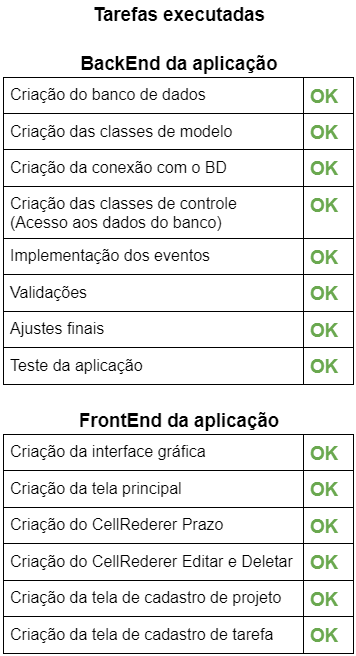

<h1 align="center">ToDoNow Gestão de tarefas</h1>
<h3 align="center">Tenha o controle das suas tarefas.</h3>
<p align="center">

</p>
<br>
<p>Definição do projeto desenvolvido no curso de Lógica de programação.</p>

<h3>Descrição:</h3>
	<p>Aplicação para o gerenciamento de projetos e tarefas.</p>

<h3>Objetivo:</h3>
<p>Resolver a questão de organização de tarefas de um ou vários projetos.</p>

<h3>Entidades:</h3>
<ul><li><h3>Projeto</h3></li></ul>

	- Nome
	- Descrição
	- Data de Criação
	- Data de Atualização

<ul><li><h3>Tarefa</h3></li></ul>

	- Nome
	- Descrição
	- Status
	- Tags
	- Observações
	- Prazo
	- Data de Criação
	- Data de Atualização

<h3>Requisitos:</h3>

- Permitir criar o projeto;
- Permitir alterar o projeto;
- Permitir deletar o projeto;

- Permitir criar a tarefa;
- Permitir alterar a tarefa;
- Permitir deletar a tarefa;

<h3>Regras de negócio:</h3>

- O sistema não contará com um sistema de login;
- Não haverá o conceito de usuário;
- Toda tarefa deve pertencer a uma lista;
- Não podem haver tags repetidas numa mesma;
- Deve ser possível filtrar as tarefas por tag;

<h3>Tecnologias utilizadas:</h3>

####


<p align="center"></p>

---

## Como rodar e testar o projeto

### 1. Pré-requisitos
- Java 17 ou superior instalado
- MySQL Server instalado e rodando
- Gradle (opcional, pois o projeto já inclui o wrapper `gradlew.bat`)
- NetBeans (opcional, para desenvolvimento)

### 2. Restaurar o banco de dados
1. Abra o MySQL Workbench, DBeaver ou terminal.
2. Crie um banco de dados chamado `todonow`:
   ```sql
   CREATE DATABASE todonow;
   ```
3. Importe o backup fornecido (arquivo `ToDoNow_20250720.sql` que está no diretório raiz do projeto):
   - Pelo terminal:
     ```sh
     mysql -u root -p todonow < ToDoNow_20250720.sql
     ```
   - Ou use a interface do seu gerenciador de banco para importar o arquivo.

### 2.1. Configurar o banco de dados (obrigatório)
Ao rodar o sistema pela primeira vez, ou se o arquivo `config.properties` estiver vazio, será necessário preencher os dados de conexão do banco de dados pelo formulário de configuração (acessível pelo botão na tela de login).

- **O sistema só tentará conectar ao banco após o usuário preencher e salvar os dados no formulário.**
- **Os dados de conexão são salvos no arquivo `config.properties` e reutilizados automaticamente nas próximas execuções.**
- **Ao abrir o formulário de configuração novamente, os últimos dados salvos serão carregados automaticamente para facilitar a edição.**

Exemplo de campos:
```
db.url=jdbc:mysql://localhost:3306/todonow
db.user=root
db.pass=123456
```
Altere os valores conforme o seu ambiente (usuário, senha, host, porta, nome do banco).

### 3. Rodando em modo desenvolvimento (NetBeans ou IDE)
1. Abra o projeto no NetBeans (abra a pasta `ToDoNow/app`).
2. Configure o banco de dados em `app/src/main/java/util/ConnectionFactory.java` se necessário (usuário, senha, porta).
3. Clique com o botão direito no projeto `app` e selecione **Executar** ou pressione `F6`.
4. O sistema abrirá a tela de login. Use um usuário já cadastrado ou cadastre um novo.

### 4. Rodando via terminal (build JAR)
1. Gere a build (caso queira recompilar):
   ```sh
   cd app
   gradlew.bat clean shadowJar
   ```
   O JAR final estará em `app/build/libs/app-fat.jar`.
2. Ou use o JAR já fornecido no diretório raiz (`ToDoNow.jar`).
3. Execute o JAR pelo terminal:
   ```sh
   java -jar ToDoNow.jar
   ```
   ou
   ```sh
   java -jar app/build/libs/app-fat.jar
   ```

### 5. Autologin seguro
- Se marcar "Mantenha me conectado" no login, um token seguro será salvo e o login será automático nas próximas execuções.
- Para deslogar, clique em "Sair" na tela principal.

### 6. Observações
- O arquivo de configuração do banco está em `app/src/main/java/util/ConnectionFactory.java`.
- O backup do banco está em `ToDoNow_20250720.sql`.
- O JAR executável está em `ToDoNow.jar` (ou `app-fat.jar`).
- Para dúvidas ou problemas, consulte o terminal para mensagens de erro.

---

<footer>
<p align="center">
Copyright © Scrybox.dev, 2023 desenvolvido por Adimael
</p>
</footer>